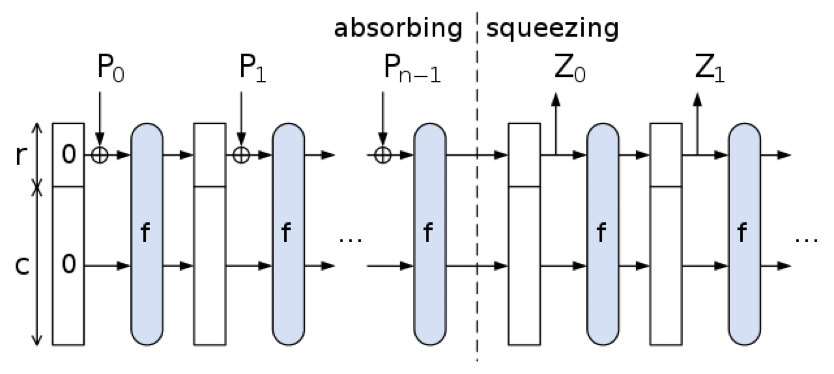

# Funkcja skrótu SHA-3

Krzysztof Surazynski

Kajetan Harla

> Proszę przetestować ciąg złożony z samych zer oraz plik TRNG_P testami statystycznymi NIST.

> Następnie proszę obliczyć skrót (SHA-3) dla obu plików w taki sposób by uzyskać niezbędna ilość danych do dalszych testów (minimum 13MB). Wyniki działania funkcji skrótu SHA-3 proszę przetestować testami statystycznymi.

> Proszę przygotować program testów tak, aby ciąg wejściowy został podzielony na podciągi o długości 1000_000 bitów (1Mb) i wykonać 100 testów (po jednym dla każdego podciągu).

> Następnie proszę przedstawić wynik w postaci uśrednionej P-wartości i składnika proporcji obliczonego w następujący sposób R = ilość zdanych testów / 100. (patrz rozdział 4.2.1 NIST SP800-22).

> Proszę wyciągnąć wnioski i przygotować raport z wykonanych ćwiczeń.


## SHA-3

Algorytm SHA-3 oparty jest na konstrukcji gąbki (sponge construction), która przetwarza dane w dwóch głównych fazach: absorpcji i wyciskania. Centralnym elementem algorytmu jest wewnętrzny stan o rozmiarze 1600 bitów, który dzielony jest na dwie części: bitrate (r) i capacity (c), gdzie r + c = 1600. W fazie absorpcji dane wejściowe są najpierw uzupełniane (paddingiem), tak aby ich długość była wielokrotnością r. Następnie są dzielone na bloki o rozmiarze r bitów, które są kolejno mieszane ze stanem za pomocą operacji XOR. Po każdym dodaniu bloku wykonywana jest permutacja Keccak-f, która przekształca cały stan za pomocą serii operacji logicznych i rotacji.

Permutacja Keccak-f składa się z 24 rund, z których każda obejmuje pięć kroków: theta, rho, pi, chi i iota. Te operacje odpowiadają za mieszanie bitów w różnych częściach stanu, wprowadzając nieliniowość i zapewniając wysoką entropię. Po zakończeniu absorpcji przechodzi się do fazy wyciskania (squeezing), w której wynikowy skrót jest odczytywany ze stanu w porcjach po r bitów. Jeśli wymagany skrót jest dłuższy niż r, wykonywane są kolejne permutacje i pobierane następne fragmenty stanu. Proces wyciskania trwa, aż zostanie uzyskana żądana długość skrótu (np. 256 bitów dla SHA3-256). W odróżnieniu od SHA-2, SHA-3 nie opiera się na dodawaniu modulo ani operacjach arytmetycznych, co czyni go bardziej odpornym na niektóre rodzaje ataków. Cała struktura SHA-3 umożliwia także elastyczne tworzenie skrótów o zmiennej długości oraz zastosowanie w funkcjach typu XOF (np. SHAKE).



### Wyniki dla TRNG_P.bit:

* ustawienia testu:
   * 100 bitstreams
   * length: 1000_000

```
------------------------------------------------------------------------------
RESULTS FOR THE UNIFORMITY OF P-VALUES AND THE PROPORTION OF PASSING SEQUENCES
------------------------------------------------------------------------------
   generator is <data/TRNG_P.bit>
------------------------------------------------------------------------------
 C1  C2  C3  C4  C5  C6  C7  C8  C9 C10  P-VALUE  PROPORTION  STATISTICAL TEST
------------------------------------------------------------------------------
  9  12   8  13   9   7  10  10  13   9  0.924076     99/100     Frequency
 10   9   7   9  11   7  13  10   8  16  0.637119    100/100     BlockFrequency
  9  14  10   6  11  13   6  10   7  14  0.494392     99/100     CumulativeSums
  8  15   6  10   7   6  10   9   9  20  0.045675     98/100     CumulativeSums
 13  12  13  10  12  10   8   7  10   5  0.699313    100/100     Runs
 10  12   7   9  18  10   9   7  12   6  0.289667     99/100     LongestRun
 14  11   8   8   5   7  14  12   8  13  0.419021     97/100     Rank
  7  15  13   5  12   6  10  12   9  11  0.401199    100/100     FFT
 12  11  11   8  12   0  10  16   9  11  0.085587    100/100     NonOverlappingTemplate
 11  11  12  11   7   9  12  10  11   6  0.924076     99/100     NonOverlappingTemplate
 10  14   9  12  10   6   4  14  13   8  0.334538     98/100     NonOverlappingTemplate
 14  10  10   8   7  10   7  14  10  10  0.798139     98/100     NonOverlappingTemplate
 10  11  16  11   7  16   7   7   5  10  0.181557     98/100     NonOverlappingTemplate
 14   8  13  10  10   7  10   8  15   5  0.419021     99/100     NonOverlappingTemplate
  6  14   7   9  12  12  11   8  10  11  0.779188    100/100     NonOverlappingTemplate
 11   8   7  12  13   9  11   7   7  15  0.616305     98/100     NonOverlappingTemplate
  4   8  12  14  10  10  10   9  11  12  0.678686     99/100     NonOverlappingTemplate
 14   4   7  17   9  11  10  11   8   9  0.224821     99/100     NonOverlappingTemplate
  4   8  16  13  10   9  12  12  11   5  0.213309    100/100     NonOverlappingTemplate
  6  10  12  16   8  10   9  11  12   6  0.514124     98/100     NonOverlappingTemplate
  5   9  10   7   5   8   8  15  18  15  0.032923     99/100     NonOverlappingTemplate
 15   7  11  11  12   8   7   7   8  14  0.514124     98/100     NonOverlappingTemplate
  8  14  11   8   9   8  12  14   9   7  0.739918    100/100     NonOverlappingTemplate
 11   9   9   8  12   9  10  13  10   9  0.987896     98/100     NonOverlappingTemplate
  9   8  10  16   9  12   8  11  10   7  0.739918    100/100     NonOverlappingTemplate
  8  13  12   4  16  12   8  12   5  10  0.181557     99/100     NonOverlappingTemplate
  8  14   7  11  13  10   8  10   9  10  0.883171    100/100     NonOverlappingTemplate
  9  12  13   8  12   7  12   9  12   6  0.779188     99/100     NonOverlappingTemplate
  7   8   9  12  12   7  13   7  15  10  0.595549     99/100     NonOverlappingTemplate
  5  19   8   9  12   7  12  10   9   9  0.162606     99/100     NonOverlappingTemplate
  9  14  10  11   8  13   8  10   8   9  0.911413    100/100     NonOverlappingTemplate
  9   9  10  16  11  10   7  11  11   6  0.678686    100/100     NonOverlappingTemplate
  7  12  13  11   8  10  10  12  11   6  0.851383     99/100     NonOverlappingTemplate
 14  13   8  12   5   7   9   9  15   8  0.366918     98/100     NonOverlappingTemplate
  5   8  16   3   6  13  10  14  12  13  0.051942     99/100     NonOverlappingTemplate
 10   9  11  12  10   9   8   8  11  12  0.991468     97/100     NonOverlappingTemplate
 11   5   9  11  10  15   7   7  10  15  0.383827     99/100     NonOverlappingTemplate
 10  10   7  12   6  13   7  11  12  12  0.779188     99/100     NonOverlappingTemplate
 10  12  11   9   7   8   9  14   8  12  0.883171    100/100     NonOverlappingTemplate
 14   5   8   5  10  13  13  13   5  14  0.129620     96/100     NonOverlappingTemplate
  9  11   7  14   6  10  11  11   9  12  0.834308    100/100     NonOverlappingTemplate
  3  11  11  13  10  12  13   8   7  12  0.437274    100/100     NonOverlappingTemplate
 15  12  11   7  10   7  11   8  10   9  0.798139    100/100     NonOverlappingTemplate
 14  13  11  12   7   5   8  12   7  11  0.514124     99/100     NonOverlappingTemplate
  8  10  12   5  15   6  11  12   8  13  0.419021    100/100     NonOverlappingTemplate
 16   8   9   4  13   8  10  11  11  10  0.419021     98/100     NonOverlappingTemplate
  9  11   9   6  10  10  10  10  13  12  0.955835     99/100     NonOverlappingTemplate
 15  10  10   9   8   6  13  11   8  10  0.739918     98/100     NonOverlappingTemplate
  7  14   5  10   8  11  10  13  10  12  0.657933    100/100     NonOverlappingTemplate
 11  10   7   8   6  11  15  10  13   9  0.678686     99/100     NonOverlappingTemplate
  8   6   9  16   6   8  12  16   5  14  0.071177     99/100     NonOverlappingTemplate
  8  13   9  13   6   9   9  10   9  14  0.759756     99/100     NonOverlappingTemplate
 14   5   9  12   7  10   9  15  11   8  0.474986     99/100     NonOverlappingTemplate
 10  14   7   5  13  11  11   8  12   9  0.637119     99/100     NonOverlappingTemplate
  8  13   8   8  14   9  10   8   8  14  0.719747     98/100     NonOverlappingTemplate
  7  10   7   9   6  11  12  11  11  16  0.554420     99/100     NonOverlappingTemplate
  7   6  13  10   9  16  10   7  12  10  0.494392     98/100     NonOverlappingTemplate
 14   8   5  12  10   8  14  10  11   8  0.595549     98/100     NonOverlappingTemplate
 17  11  12   6   8  13   6  11   7   9  0.275709     97/100     NonOverlappingTemplate
 13  10   9  11   5  10  11  11   6  14  0.637119    100/100     NonOverlappingTemplate
 15  12   4  15   9   7   7  12   9  10  0.249284     99/100     NonOverlappingTemplate
 10  12  10   7  12  12   4  12  13   8  0.595549     99/100     NonOverlappingTemplate
  8  13  17  10  11   8  10   8   6   9  0.455937     98/100     NonOverlappingTemplate
 12   9  12  15   8  11   7   6   8  12  0.616305    100/100     NonOverlappingTemplate
  8   9  11   6  14   9  13  12   8  10  0.779188     99/100     NonOverlappingTemplate
 10   6  10  11   8  15  14   5  10  11  0.455937     99/100     NonOverlappingTemplate
 11  12  12  12   9  13   7  11   7   6  0.759756    100/100     NonOverlappingTemplate
 17  10  15   8   7  13   9   6   8   7  0.181557     98/100     NonOverlappingTemplate
 10  14   7   9  12   9  10   6   9  14  0.699313    100/100     NonOverlappingTemplate
  3   9  12   8  11  10  12  12   9  14  0.494392     99/100     NonOverlappingTemplate
 17   6  12   5  10   8  15   9  10   8  0.171867     97/100     NonOverlappingTemplate
  8  12  11  13  10   4  11   6  12  13  0.494392     99/100     NonOverlappingTemplate
  9  10   9   9  14   6  15  10   5  13  0.401199    100/100     NonOverlappingTemplate
 11  12   6  12   4   9  12  16   3  15  0.040108    100/100     NonOverlappingTemplate
  8   6   8  13  13  13   7  10  11  11  0.719747     99/100     NonOverlappingTemplate
 11  11   7   9   9  14   8   7  14  10  0.759756    100/100     NonOverlappingTemplate
 11   9   9  10   9  12  14  11   3  12  0.554420     99/100     NonOverlappingTemplate
  7  14  12  13  10   7   8  10  12   7  0.699313    100/100     NonOverlappingTemplate
 10   7  11  11   8  11   9  11  15   7  0.816537     99/100     NonOverlappingTemplate
  6  18   6  16   9  14   6   8   5  12  0.019188    100/100     NonOverlappingTemplate
 15  14  11   9  11   7   6  11  10   6  0.474986     98/100     NonOverlappingTemplate
 11   8  19   4   8   8  12   6  11  13  0.066882    100/100     NonOverlappingTemplate
 12  11  11   8  12   0  10  15  10  11  0.122325    100/100     NonOverlappingTemplate
 10  11   9   6  10   5   8  12  18  11  0.236810    100/100     NonOverlappingTemplate
 16  10   8   9  13  10  12   6   7   9  0.534146     96/100     NonOverlappingTemplate
 12   6  11  13  11  11   3   8  15  10  0.275709     99/100     NonOverlappingTemplate
  9   5  16   9   6  12   7  11  15  10  0.224821     99/100     NonOverlappingTemplate
 17  14   4  11   8   7  11  11   9   8  0.202268    100/100     NonOverlappingTemplate
 11   7   9   7  13   8  12  11  14   8  0.759756     99/100     NonOverlappingTemplate
  7   9  11  14   5   7  10  15  11  11  0.455937     98/100     NonOverlappingTemplate
 12  11   8   9   8  15   8  10   7  12  0.779188    100/100     NonOverlappingTemplate
 13   8  10  14   6  13  14   6  10   6  0.334538     99/100     NonOverlappingTemplate
  8   6  10  13  14   8  12   9   7  13  0.616305     99/100     NonOverlappingTemplate
  9  11   8   9  13   7  11  13   7  12  0.851383     99/100     NonOverlappingTemplate
 12   6   7  12  15   7  12  11   6  12  0.419021     98/100     NonOverlappingTemplate
  9  10   6  14   6  11  11   9  17   7  0.275709     99/100     NonOverlappingTemplate
 11  13  15   5   9  15  10   7   8   7  0.289667    100/100     NonOverlappingTemplate
  9  10   9  12  14   7   7  10   8  14  0.739918     99/100     NonOverlappingTemplate
  9   8  19  10  10  13   9   3  10   9  0.102526    100/100     NonOverlappingTemplate
 12   8  10  14  11   8  11  11   6   9  0.851383    100/100     NonOverlappingTemplate
 10   7  18   7   5  11  11  15  11   5  0.066882     99/100     NonOverlappingTemplate
  7  12   8  12  11  15  12   8   5  10  0.534146     97/100     NonOverlappingTemplate
  9   9   4  13   7   7  10  15  12  14  0.275709     99/100     NonOverlappingTemplate
  8  11  11  12  20   8   4   8  14   4  0.014550     99/100     NonOverlappingTemplate
 11   8   6   7  11  12   8  13  14  10  0.699313     97/100     NonOverlappingTemplate
 10  12  12   5  10   9  12  11  10   9  0.911413     98/100     NonOverlappingTemplate
  9  11  10  12   9  12   7  10  12   8  0.971699    100/100     NonOverlappingTemplate
  8  12  12   9   3  12  15   8  10  11  0.383827     99/100     NonOverlappingTemplate
 13   6   9  12  12  11   8   9  13   7  0.759756     98/100     NonOverlappingTemplate
  4  15  10   7  15   9  10   7   6  17  0.048716     99/100     NonOverlappingTemplate
 11   8   6  17   5  12  10  10   9  12  0.319084     97/100     NonOverlappingTemplate
 11   9   8  12  12   2   7  16   9  14  0.122325     98/100     NonOverlappingTemplate
  7  10  11   9  12   8  11  15   9   8  0.834308    100/100     NonOverlappingTemplate
  8  14   9  13  12   8   5  11  12   8  0.616305    100/100     NonOverlappingTemplate
  4  12  13   9  13   7   5  13   7  17  0.066882    100/100     NonOverlappingTemplate
  8  10  12  10   9  12  10   9  11   9  0.996335     99/100     NonOverlappingTemplate
  9   6  10   8  12  10  13  16   8   8  0.554420     99/100     NonOverlappingTemplate
 11  10   8   7  13  10   9  10  11  11  0.978072     98/100     NonOverlappingTemplate
 11  14  11   8   9   4   9  13  10  11  0.637119     98/100     NonOverlappingTemplate
 11  12  11   8   9   9  10  10  12   8  0.991468     98/100     NonOverlappingTemplate
 13  12  11  15  12   4   8   7  11   7  0.334538     98/100     NonOverlappingTemplate
 11  10  12   5   8  12   8  13   9  12  0.779188    100/100     NonOverlappingTemplate
 12  12   5   8   8  13  10   9  16   7  0.383827    100/100     NonOverlappingTemplate
  8   6   7  15  11  14  10   8  12   9  0.534146     98/100     NonOverlappingTemplate
 14  13   9   5   4   9   9  13  14  10  0.249284     99/100     NonOverlappingTemplate
  9   7   9   9  12  12  10  13   8  11  0.946308     98/100     NonOverlappingTemplate
 11  14  15   4  12  12   7   8  10   7  0.289667     97/100     NonOverlappingTemplate
 14  12  12  12   6   4  12   1  15  12  0.021999     98/100     NonOverlappingTemplate
  6  14  12   9  15  12   5  12   7   8  0.289667     99/100     NonOverlappingTemplate
 11  13  16   8   7   6  11   8   9  11  0.514124     99/100     NonOverlappingTemplate
  9   7  11   9  13  14  11   5   7  14  0.455937    100/100     NonOverlappingTemplate
 10   9   8   9   8  12   9   8  13  14  0.883171    100/100     NonOverlappingTemplate
  9   8  12  11   8  14  10   7   8  13  0.816537    100/100     NonOverlappingTemplate
  9   8   5   7   6  15  10  10  15  15  0.162606     99/100     NonOverlappingTemplate
 13   9  10   9  11  13  12   7   8   8  0.897763     98/100     NonOverlappingTemplate
 11  10  15  14  12   9   9   5   6   9  0.437274     98/100     NonOverlappingTemplate
  9  12   6  10  15  12   9   4  12  11  0.419021     99/100     NonOverlappingTemplate
 16  10   9   8  11   6   8   6  12  14  0.366918     99/100     NonOverlappingTemplate
 13   7   8   9  12  12   9  10   8  12  0.911413     99/100     NonOverlappingTemplate
 11  10   7  14   9   7  11   9  14   8  0.759756     99/100     NonOverlappingTemplate
 13  11  15   7  10  10   6  13   8   7  0.514124     97/100     NonOverlappingTemplate
 11   5  14   8  10  11   9   7  18   7  0.162606     98/100     NonOverlappingTemplate
  7   6  19  11   7   5   9  11   9  16  0.035174    100/100     NonOverlappingTemplate
 10   9   8  12  13   9   6  10   9  14  0.816537     98/100     NonOverlappingTemplate
  6  14  13   9   6  12  12   9  10   9  0.657933    100/100     NonOverlappingTemplate
  9  10   8  11   9  10  14   6  15   8  0.657933     98/100     NonOverlappingTemplate
 13   8  11  11   9   6  15   5  10  12  0.474986     99/100     NonOverlappingTemplate
 13   8   7  12  14  10  10  10  10   6  0.759756     99/100     NonOverlappingTemplate
  6  13   7  12   6  18   8   8  11  11  0.171867     99/100     NonOverlappingTemplate
 12   7   9   8   9  13   6   8  15  13  0.514124     98/100     NonOverlappingTemplate
  6  10  14  14   9   7   9   6  15  10  0.350485    100/100     NonOverlappingTemplate
  7  11  13   9  13  15   9   9   4  10  0.419021    100/100     NonOverlappingTemplate
  7   9  11  10  14  17   5   4  12  11  0.115387     99/100     NonOverlappingTemplate
 11   8  10  13   9   7  13   5   9  15  0.494392     99/100     NonOverlappingTemplate
 12   5   8  11  12   7  12  13  12   8  0.657933    100/100     NonOverlappingTemplate
 11   8  19   4   8   8  12   6  11  13  0.066882    100/100     NonOverlappingTemplate
 12  10  10  11  11  11  10   8   8   9  0.996335     99/100     OverlappingTemplate
 10   7  12   6  13   9  13   9   8  13  0.719747     99/100     Universal
 16   7  14   6   6  18   3  13   7  10  0.007694     97/100     ApproximateEntropy
  6   8   6   4   6   4   5   5   6   5  0.964295     54/55      RandomExcursions
  6   6   3   7   2   7   5  11   3   5  0.181557     55/55      RandomExcursions
  4   4   7   8   3   8   3   5   7   6  0.595549     55/55      RandomExcursions
  4   5   5   8   5   6   5   5   8   4  0.897763     55/55      RandomExcursions
  6   1   8   5   8   3   7   3   9   5  0.181557     55/55      RandomExcursions
  8   6   6   7   6   4   4   6   5   3  0.867692     54/55      RandomExcursions
  6   7   7   3   3   4   5   7   9   4  0.554420     53/55      RandomExcursions
  7   5   6   4   3  12   4   5   5   4  0.202268     55/55      RandomExcursions
  5   8   8   8   7   6   2   4   4   3  0.401199     54/55      RandomExcursionsVariant
  6   4   9   8  10   5   5   3   4   1  0.102526     55/55      RandomExcursionsVariant
  5   6   6   9   8   7   3   6   3   2  0.366918     55/55      RandomExcursionsVariant
  8   5   5   9   8   5   3   3   5   4  0.474986     54/55      RandomExcursionsVariant
  9   5   6   7   4   4   4   5   6   5  0.834308     54/55      RandomExcursionsVariant
  6   5   8   5   7   6   5   4   5   4  0.946308     55/55      RandomExcursionsVariant
  3   9   9   6   6   5   4   5   6   2  0.366918     54/55      RandomExcursionsVariant
  5   3   8   9   8   8   5   2   2   5  0.162606     54/55      RandomExcursionsVariant
  6   1   5   8   6   6  10   3   2   8  0.090936     55/55      RandomExcursionsVariant
  6   7   5   3   5   3  12   7   4   3  0.115387     55/55      RandomExcursionsVariant
  4   7   6   6   4  11   4   7   3   3  0.249284     55/55      RandomExcursionsVariant
  4  10   6   8   6   5   4   3   4   5  0.474986     55/55      RandomExcursionsVariant
  5   7   9   5   6   7   7   1   2   6  0.275709     55/55      RandomExcursionsVariant
  4   9   7   7   4   5   3   4   7   5  0.637119     55/55      RandomExcursionsVariant
  3   8   7  10   6   1   5   7   4   4  0.162606     55/55      RandomExcursionsVariant
  5   3  10   9   3   4   4   6   1  10  0.028817     55/55      RandomExcursionsVariant
  6   3   7  10   2   4   6   4   8   5  0.275709     55/55      RandomExcursionsVariant
  5   4   7   8   6   2   9   7   2   5  0.304126     55/55      RandomExcursionsVariant
 13  14   1  10   8  22   2  11  12   7  0.000123     97/100     Serial
  9   9  14  12  10   8   9   9  10  10  0.971699     99/100     Serial
 11  11   9  12  12   8   8   8  11  10  0.983453     99/100     LinearComplexity


- - - - - - - - - - - - - - - - - - - - - - - - - - - - - - - - - - - - - - - - -
The minimum pass rate for each statistical test with the exception of the
random excursion (variant) test is approximately = 96 for a
sample size = 100 binary sequences.

The minimum pass rate for the random excursion (variant) test
is approximately = 52 for a sample size = 55 binary sequences.

For further guidelines construct a probability table using the MAPLE program
provided in the addendum section of the documentation.
- - - - - - - - - - - - - - - - - - - - - - - - - - - - - - - - - - - - - - - - -

```

### Wyniki dla zeros.bit

* plik składa się z samych zer binarnych
* plik 143 MB
* ustawienia testu:
   * 100 bitstreams
   * length: 1000_000


```
------------------------------------------------------------------------------
RESULTS FOR THE UNIFORMITY OF P-VALUES AND THE PROPORTION OF PASSING SEQUENCES
------------------------------------------------------------------------------
   generator is <data/zeros.bit>
------------------------------------------------------------------------------
 C1  C2  C3  C4  C5  C6  C7  C8  C9 C10  P-VALUE  PROPORTION  STATISTICAL TEST
------------------------------------------------------------------------------
100   0   0   0   0   0   0   0   0   0  0.000000 *    0/100  *  Frequency
100   0   0   0   0   0   0   0   0   0  0.000000 *    0/100  *  BlockFrequency
100   0   0   0   0   0   0   0   0   0  0.000000 *    0/100  *  CumulativeSums
100   0   0   0   0   0   0   0   0   0  0.000000 *    0/100  *  CumulativeSums
100   0   0   0   0   0   0   0   0   0  0.000000 *    0/100  *  Runs
100   0   0   0   0   0   0   0   0   0  0.000000 *    0/100  *  LongestRun
100   0   0   0   0   0   0   0   0   0  0.000000 *    0/100  *  Rank
100   0   0   0   0   0   0   0   0   0  0.000000 *    0/100  *  FFT
100   0   0   0   0   0   0   0   0   0  0.000000 *    0/100  *  NonOverlappingTemplate
100   0   0   0   0   0   0   0   0   0  0.000000 *    0/100  *  NonOverlappingTemplate
100   0   0   0   0   0   0   0   0   0  0.000000 *    0/100  *  NonOverlappingTemplate
100   0   0   0   0   0   0   0   0   0  0.000000 *    0/100  *  NonOverlappingTemplate
100   0   0   0   0   0   0   0   0   0  0.000000 *    0/100  *  NonOverlappingTemplate
100   0   0   0   0   0   0   0   0   0  0.000000 *    0/100  *  NonOverlappingTemplate
100   0   0   0   0   0   0   0   0   0  0.000000 *    0/100  *  NonOverlappingTemplate
100   0   0   0   0   0   0   0   0   0  0.000000 *    0/100  *  NonOverlappingTemplate
100   0   0   0   0   0   0   0   0   0  0.000000 *    0/100  *  NonOverlappingTemplate
100   0   0   0   0   0   0   0   0   0  0.000000 *    0/100  *  NonOverlappingTemplate
100   0   0   0   0   0   0   0   0   0  0.000000 *    0/100  *  NonOverlappingTemplate
100   0   0   0   0   0   0   0   0   0  0.000000 *    0/100  *  NonOverlappingTemplate
100   0   0   0   0   0   0   0   0   0  0.000000 *    0/100  *  NonOverlappingTemplate
100   0   0   0   0   0   0   0   0   0  0.000000 *    0/100  *  NonOverlappingTemplate
100   0   0   0   0   0   0   0   0   0  0.000000 *    0/100  *  NonOverlappingTemplate
100   0   0   0   0   0   0   0   0   0  0.000000 *    0/100  *  NonOverlappingTemplate
100   0   0   0   0   0   0   0   0   0  0.000000 *    0/100  *  NonOverlappingTemplate
100   0   0   0   0   0   0   0   0   0  0.000000 *    0/100  *  NonOverlappingTemplate
100   0   0   0   0   0   0   0   0   0  0.000000 *    0/100  *  NonOverlappingTemplate
100   0   0   0   0   0   0   0   0   0  0.000000 *    0/100  *  NonOverlappingTemplate
100   0   0   0   0   0   0   0   0   0  0.000000 *    0/100  *  NonOverlappingTemplate
100   0   0   0   0   0   0   0   0   0  0.000000 *    0/100  *  NonOverlappingTemplate
100   0   0   0   0   0   0   0   0   0  0.000000 *    0/100  *  NonOverlappingTemplate
100   0   0   0   0   0   0   0   0   0  0.000000 *    0/100  *  NonOverlappingTemplate
100   0   0   0   0   0   0   0   0   0  0.000000 *    0/100  *  NonOverlappingTemplate
100   0   0   0   0   0   0   0   0   0  0.000000 *    0/100  *  NonOverlappingTemplate
100   0   0   0   0   0   0   0   0   0  0.000000 *    0/100  *  NonOverlappingTemplate
100   0   0   0   0   0   0   0   0   0  0.000000 *    0/100  *  NonOverlappingTemplate
100   0   0   0   0   0   0   0   0   0  0.000000 *    0/100  *  NonOverlappingTemplate
100   0   0   0   0   0   0   0   0   0  0.000000 *    0/100  *  NonOverlappingTemplate
100   0   0   0   0   0   0   0   0   0  0.000000 *    0/100  *  NonOverlappingTemplate
100   0   0   0   0   0   0   0   0   0  0.000000 *    0/100  *  NonOverlappingTemplate
100   0   0   0   0   0   0   0   0   0  0.000000 *    0/100  *  NonOverlappingTemplate
100   0   0   0   0   0   0   0   0   0  0.000000 *    0/100  *  NonOverlappingTemplate
100   0   0   0   0   0   0   0   0   0  0.000000 *    0/100  *  NonOverlappingTemplate
100   0   0   0   0   0   0   0   0   0  0.000000 *    0/100  *  NonOverlappingTemplate
100   0   0   0   0   0   0   0   0   0  0.000000 *    0/100  *  NonOverlappingTemplate
100   0   0   0   0   0   0   0   0   0  0.000000 *    0/100  *  NonOverlappingTemplate
100   0   0   0   0   0   0   0   0   0  0.000000 *    0/100  *  NonOverlappingTemplate
100   0   0   0   0   0   0   0   0   0  0.000000 *    0/100  *  NonOverlappingTemplate
100   0   0   0   0   0   0   0   0   0  0.000000 *    0/100  *  NonOverlappingTemplate
100   0   0   0   0   0   0   0   0   0  0.000000 *    0/100  *  NonOverlappingTemplate
100   0   0   0   0   0   0   0   0   0  0.000000 *    0/100  *  NonOverlappingTemplate
100   0   0   0   0   0   0   0   0   0  0.000000 *    0/100  *  NonOverlappingTemplate
100   0   0   0   0   0   0   0   0   0  0.000000 *    0/100  *  NonOverlappingTemplate
100   0   0   0   0   0   0   0   0   0  0.000000 *    0/100  *  NonOverlappingTemplate
100   0   0   0   0   0   0   0   0   0  0.000000 *    0/100  *  NonOverlappingTemplate
100   0   0   0   0   0   0   0   0   0  0.000000 *    0/100  *  NonOverlappingTemplate
100   0   0   0   0   0   0   0   0   0  0.000000 *    0/100  *  NonOverlappingTemplate
100   0   0   0   0   0   0   0   0   0  0.000000 *    0/100  *  NonOverlappingTemplate
100   0   0   0   0   0   0   0   0   0  0.000000 *    0/100  *  NonOverlappingTemplate
100   0   0   0   0   0   0   0   0   0  0.000000 *    0/100  *  NonOverlappingTemplate
100   0   0   0   0   0   0   0   0   0  0.000000 *    0/100  *  NonOverlappingTemplate
100   0   0   0   0   0   0   0   0   0  0.000000 *    0/100  *  NonOverlappingTemplate
100   0   0   0   0   0   0   0   0   0  0.000000 *    0/100  *  NonOverlappingTemplate
100   0   0   0   0   0   0   0   0   0  0.000000 *    0/100  *  NonOverlappingTemplate
100   0   0   0   0   0   0   0   0   0  0.000000 *    0/100  *  NonOverlappingTemplate
100   0   0   0   0   0   0   0   0   0  0.000000 *    0/100  *  NonOverlappingTemplate
100   0   0   0   0   0   0   0   0   0  0.000000 *    0/100  *  NonOverlappingTemplate
100   0   0   0   0   0   0   0   0   0  0.000000 *    0/100  *  NonOverlappingTemplate
100   0   0   0   0   0   0   0   0   0  0.000000 *    0/100  *  NonOverlappingTemplate
100   0   0   0   0   0   0   0   0   0  0.000000 *    0/100  *  NonOverlappingTemplate
100   0   0   0   0   0   0   0   0   0  0.000000 *    0/100  *  NonOverlappingTemplate
100   0   0   0   0   0   0   0   0   0  0.000000 *    0/100  *  NonOverlappingTemplate
100   0   0   0   0   0   0   0   0   0  0.000000 *    0/100  *  NonOverlappingTemplate
100   0   0   0   0   0   0   0   0   0  0.000000 *    0/100  *  NonOverlappingTemplate
100   0   0   0   0   0   0   0   0   0  0.000000 *    0/100  *  NonOverlappingTemplate
100   0   0   0   0   0   0   0   0   0  0.000000 *    0/100  *  NonOverlappingTemplate
100   0   0   0   0   0   0   0   0   0  0.000000 *    0/100  *  NonOverlappingTemplate
100   0   0   0   0   0   0   0   0   0  0.000000 *    0/100  *  NonOverlappingTemplate
100   0   0   0   0   0   0   0   0   0  0.000000 *    0/100  *  NonOverlappingTemplate
100   0   0   0   0   0   0   0   0   0  0.000000 *    0/100  *  NonOverlappingTemplate
100   0   0   0   0   0   0   0   0   0  0.000000 *    0/100  *  NonOverlappingTemplate
100   0   0   0   0   0   0   0   0   0  0.000000 *    0/100  *  NonOverlappingTemplate
100   0   0   0   0   0   0   0   0   0  0.000000 *    0/100  *  NonOverlappingTemplate
100   0   0   0   0   0   0   0   0   0  0.000000 *    0/100  *  NonOverlappingTemplate
100   0   0   0   0   0   0   0   0   0  0.000000 *    0/100  *  NonOverlappingTemplate
100   0   0   0   0   0   0   0   0   0  0.000000 *    0/100  *  NonOverlappingTemplate
100   0   0   0   0   0   0   0   0   0  0.000000 *    0/100  *  NonOverlappingTemplate
100   0   0   0   0   0   0   0   0   0  0.000000 *    0/100  *  NonOverlappingTemplate
100   0   0   0   0   0   0   0   0   0  0.000000 *    0/100  *  NonOverlappingTemplate
100   0   0   0   0   0   0   0   0   0  0.000000 *    0/100  *  NonOverlappingTemplate
100   0   0   0   0   0   0   0   0   0  0.000000 *    0/100  *  NonOverlappingTemplate
100   0   0   0   0   0   0   0   0   0  0.000000 *    0/100  *  NonOverlappingTemplate
100   0   0   0   0   0   0   0   0   0  0.000000 *    0/100  *  NonOverlappingTemplate
100   0   0   0   0   0   0   0   0   0  0.000000 *    0/100  *  NonOverlappingTemplate
100   0   0   0   0   0   0   0   0   0  0.000000 *    0/100  *  NonOverlappingTemplate
100   0   0   0   0   0   0   0   0   0  0.000000 *    0/100  *  NonOverlappingTemplate
100   0   0   0   0   0   0   0   0   0  0.000000 *    0/100  *  NonOverlappingTemplate
100   0   0   0   0   0   0   0   0   0  0.000000 *    0/100  *  NonOverlappingTemplate
100   0   0   0   0   0   0   0   0   0  0.000000 *    0/100  *  NonOverlappingTemplate
100   0   0   0   0   0   0   0   0   0  0.000000 *    0/100  *  NonOverlappingTemplate
100   0   0   0   0   0   0   0   0   0  0.000000 *    0/100  *  NonOverlappingTemplate
100   0   0   0   0   0   0   0   0   0  0.000000 *    0/100  *  NonOverlappingTemplate
100   0   0   0   0   0   0   0   0   0  0.000000 *    0/100  *  NonOverlappingTemplate
100   0   0   0   0   0   0   0   0   0  0.000000 *    0/100  *  NonOverlappingTemplate
100   0   0   0   0   0   0   0   0   0  0.000000 *    0/100  *  NonOverlappingTemplate
100   0   0   0   0   0   0   0   0   0  0.000000 *    0/100  *  NonOverlappingTemplate
100   0   0   0   0   0   0   0   0   0  0.000000 *    0/100  *  NonOverlappingTemplate
100   0   0   0   0   0   0   0   0   0  0.000000 *    0/100  *  NonOverlappingTemplate
100   0   0   0   0   0   0   0   0   0  0.000000 *    0/100  *  NonOverlappingTemplate
100   0   0   0   0   0   0   0   0   0  0.000000 *    0/100  *  NonOverlappingTemplate
100   0   0   0   0   0   0   0   0   0  0.000000 *    0/100  *  NonOverlappingTemplate
100   0   0   0   0   0   0   0   0   0  0.000000 *    0/100  *  NonOverlappingTemplate
100   0   0   0   0   0   0   0   0   0  0.000000 *    0/100  *  NonOverlappingTemplate
100   0   0   0   0   0   0   0   0   0  0.000000 *    0/100  *  NonOverlappingTemplate
100   0   0   0   0   0   0   0   0   0  0.000000 *    0/100  *  NonOverlappingTemplate
100   0   0   0   0   0   0   0   0   0  0.000000 *    0/100  *  NonOverlappingTemplate
100   0   0   0   0   0   0   0   0   0  0.000000 *    0/100  *  NonOverlappingTemplate
100   0   0   0   0   0   0   0   0   0  0.000000 *    0/100  *  NonOverlappingTemplate
100   0   0   0   0   0   0   0   0   0  0.000000 *    0/100  *  NonOverlappingTemplate
100   0   0   0   0   0   0   0   0   0  0.000000 *    0/100  *  NonOverlappingTemplate
100   0   0   0   0   0   0   0   0   0  0.000000 *    0/100  *  NonOverlappingTemplate
100   0   0   0   0   0   0   0   0   0  0.000000 *    0/100  *  NonOverlappingTemplate
100   0   0   0   0   0   0   0   0   0  0.000000 *    0/100  *  NonOverlappingTemplate
100   0   0   0   0   0   0   0   0   0  0.000000 *    0/100  *  NonOverlappingTemplate
100   0   0   0   0   0   0   0   0   0  0.000000 *    0/100  *  NonOverlappingTemplate
100   0   0   0   0   0   0   0   0   0  0.000000 *    0/100  *  NonOverlappingTemplate
100   0   0   0   0   0   0   0   0   0  0.000000 *    0/100  *  NonOverlappingTemplate
100   0   0   0   0   0   0   0   0   0  0.000000 *    0/100  *  NonOverlappingTemplate
100   0   0   0   0   0   0   0   0   0  0.000000 *    0/100  *  NonOverlappingTemplate
100   0   0   0   0   0   0   0   0   0  0.000000 *    0/100  *  NonOverlappingTemplate
100   0   0   0   0   0   0   0   0   0  0.000000 *    0/100  *  NonOverlappingTemplate
100   0   0   0   0   0   0   0   0   0  0.000000 *    0/100  *  NonOverlappingTemplate
100   0   0   0   0   0   0   0   0   0  0.000000 *    0/100  *  NonOverlappingTemplate
100   0   0   0   0   0   0   0   0   0  0.000000 *    0/100  *  NonOverlappingTemplate
100   0   0   0   0   0   0   0   0   0  0.000000 *    0/100  *  NonOverlappingTemplate
100   0   0   0   0   0   0   0   0   0  0.000000 *    0/100  *  NonOverlappingTemplate
100   0   0   0   0   0   0   0   0   0  0.000000 *    0/100  *  NonOverlappingTemplate
100   0   0   0   0   0   0   0   0   0  0.000000 *    0/100  *  NonOverlappingTemplate
100   0   0   0   0   0   0   0   0   0  0.000000 *    0/100  *  NonOverlappingTemplate
100   0   0   0   0   0   0   0   0   0  0.000000 *    0/100  *  NonOverlappingTemplate
100   0   0   0   0   0   0   0   0   0  0.000000 *    0/100  *  NonOverlappingTemplate
100   0   0   0   0   0   0   0   0   0  0.000000 *    0/100  *  NonOverlappingTemplate
100   0   0   0   0   0   0   0   0   0  0.000000 *    0/100  *  NonOverlappingTemplate
100   0   0   0   0   0   0   0   0   0  0.000000 *    0/100  *  NonOverlappingTemplate
100   0   0   0   0   0   0   0   0   0  0.000000 *    0/100  *  NonOverlappingTemplate
100   0   0   0   0   0   0   0   0   0  0.000000 *    0/100  *  NonOverlappingTemplate
100   0   0   0   0   0   0   0   0   0  0.000000 *    0/100  *  NonOverlappingTemplate
100   0   0   0   0   0   0   0   0   0  0.000000 *    0/100  *  NonOverlappingTemplate
100   0   0   0   0   0   0   0   0   0  0.000000 *    0/100  *  NonOverlappingTemplate
100   0   0   0   0   0   0   0   0   0  0.000000 *    0/100  *  NonOverlappingTemplate
100   0   0   0   0   0   0   0   0   0  0.000000 *    0/100  *  NonOverlappingTemplate
100   0   0   0   0   0   0   0   0   0  0.000000 *    0/100  *  NonOverlappingTemplate
100   0   0   0   0   0   0   0   0   0  0.000000 *    0/100  *  NonOverlappingTemplate
100   0   0   0   0   0   0   0   0   0  0.000000 *    0/100  *  NonOverlappingTemplate
100   0   0   0   0   0   0   0   0   0  0.000000 *    0/100  *  NonOverlappingTemplate
100   0   0   0   0   0   0   0   0   0  0.000000 *    0/100  *  NonOverlappingTemplate
100   0   0   0   0   0   0   0   0   0  0.000000 *    0/100  *  OverlappingTemplate
100   0   0   0   0   0   0   0   0   0  0.000000 *    0/100  *  Universal
100   0   0   0   0   0   0   0   0   0  0.000000 *    0/100  *  ApproximateEntropy
  0   0   0   0   0   0   0   0   0   0     ----     ------     RandomExcursions
  0   0   0   0   0   0   0   0   0   0     ----     ------     RandomExcursions
  0   0   0   0   0   0   0   0   0   0     ----     ------     RandomExcursions
  0   0   0   0   0   0   0   0   0   0     ----     ------     RandomExcursions
  0   0   0   0   0   0   0   0   0   0     ----     ------     RandomExcursions
  0   0   0   0   0   0   0   0   0   0     ----     ------     RandomExcursions
  0   0   0   0   0   0   0   0   0   0     ----     ------     RandomExcursions
  0   0   0   0   0   0   0   0   0   0     ----     ------     RandomExcursions
  0   0   0   0   0   0   0   0   0   0     ----     ------     RandomExcursionsVariant
  0   0   0   0   0   0   0   0   0   0     ----     ------     RandomExcursionsVariant
  0   0   0   0   0   0   0   0   0   0     ----     ------     RandomExcursionsVariant
  0   0   0   0   0   0   0   0   0   0     ----     ------     RandomExcursionsVariant
  0   0   0   0   0   0   0   0   0   0     ----     ------     RandomExcursionsVariant
  0   0   0   0   0   0   0   0   0   0     ----     ------     RandomExcursionsVariant
  0   0   0   0   0   0   0   0   0   0     ----     ------     RandomExcursionsVariant
  0   0   0   0   0   0   0   0   0   0     ----     ------     RandomExcursionsVariant
  0   0   0   0   0   0   0   0   0   0     ----     ------     RandomExcursionsVariant
  0   0   0   0   0   0   0   0   0   0     ----     ------     RandomExcursionsVariant
  0   0   0   0   0   0   0   0   0   0     ----     ------     RandomExcursionsVariant
  0   0   0   0   0   0   0   0   0   0     ----     ------     RandomExcursionsVariant
  0   0   0   0   0   0   0   0   0   0     ----     ------     RandomExcursionsVariant
  0   0   0   0   0   0   0   0   0   0     ----     ------     RandomExcursionsVariant
  0   0   0   0   0   0   0   0   0   0     ----     ------     RandomExcursionsVariant
  0   0   0   0   0   0   0   0   0   0     ----     ------     RandomExcursionsVariant
  0   0   0   0   0   0   0   0   0   0     ----     ------     RandomExcursionsVariant
  0   0   0   0   0   0   0   0   0   0     ----     ------     RandomExcursionsVariant
100   0   0   0   0   0   0   0   0   0  0.000000 *    0/100  *  Serial
100   0   0   0   0   0   0   0   0   0  0.000000 *    0/100  *  Serial
100   0   0   0   0   0   0   0   0   0  0.000000 *    0/100  *  LinearComplexity


- - - - - - - - - - - - - - - - - - - - - - - - - - - - - - - - - - - - - - - - -
The minimum pass rate for each statistical test with the exception of the
random excursion (variant) test is approximately = 96 for a
sample size = 100 binary sequences.

The minimum pass rate for the random excursion (variant) test is undefined.

For further guidelines construct a probability table using the MAPLE program
provided in the addendum section of the documentation.
- - - - - - - - - - - - - - - - - - - - - - - - - - - - - - - - - - - - - - - - -
```

### Wyniki dla TRNG_P_sha3.bit

* plik 128 MB (tak jak plik TRNG_P)
* hash utworzony w skali 1:1
* ustawienia testu:
   * 100 bitstreams
   * length: 1000_000

```
------------------------------------------------------------------------------
RESULTS FOR THE UNIFORMITY OF P-VALUES AND THE PROPORTION OF PASSING SEQUENCES
------------------------------------------------------------------------------
   generator is <data/TRNG_P_sha3.bit>
------------------------------------------------------------------------------
 C1  C2  C3  C4  C5  C6  C7  C8  C9 C10  P-VALUE  PROPORTION  STATISTICAL TEST
------------------------------------------------------------------------------
  5  12  11   7   8  13   9  10  15  10  0.554420    100/100     Frequency
 11   8  13  16   7   9  13   6   8   9  0.437274     99/100     BlockFrequency
  7   9   8   9  12   6  13  12   8  16  0.455937    100/100     CumulativeSums
  3  11  17   8   7   7   6  16  12  13  0.028817     99/100     CumulativeSums
 10  15  14  11   5  12   7  12   8   6  0.319084    100/100     Runs
 14  11   9  14  12  10  10  11   6   3  0.319084     99/100     LongestRun
 10  11  15   8   5   8  14   8  13   8  0.419021    100/100     Rank
  9  12  12   8   8  12  11  12   8   8  0.946308     99/100     FFT
  7   9  10   7   5  12  11  15  14  10  0.437274     99/100     NonOverlappingTemplate
 11   7  14   7  10   3  10  15  14   9  0.181557     99/100     NonOverlappingTemplate
  8   5   9  12  14   9   7  12  14  10  0.534146     98/100     NonOverlappingTemplate
 12   9  12  10   6   4  10  11  12  14  0.514124     99/100     NonOverlappingTemplate
  6  11  13  18   6   8  17   8   7   6  0.026948    100/100     NonOverlappingTemplate
  3  12  12  12  12  11   7  11   6  14  0.289667    100/100     NonOverlappingTemplate
 14   9  11   9   9   7  13  10  11   7  0.851383     97/100     NonOverlappingTemplate
  3   8   5   9   8  15  18   8  14  12  0.020548    100/100     NonOverlappingTemplate
  6   7   8  11  16  13  11  11  10   7  0.474986    100/100     NonOverlappingTemplate
 11   8   7   9  13   8  12  12  11   9  0.924076     98/100     NonOverlappingTemplate
  9  12   9  16   1   7  11  10  10  15  0.071177     99/100     NonOverlappingTemplate
 11  13  11  10   4  11   9  12  10   9  0.798139     99/100     NonOverlappingTemplate
  7  10  19   9   7  14  11   8   7   8  0.145326     99/100     NonOverlappingTemplate
  6  11  11   8  17  10  17   5   3  12  0.019188    100/100     NonOverlappingTemplate
 13  11  14   6   7  12  10  10   9   8  0.739918    100/100     NonOverlappingTemplate
  9   9  14  10   8  15  10   4   8  13  0.383827    100/100     NonOverlappingTemplate
 10   9   9   8  12  12   8  10  13   9  0.971699     97/100     NonOverlappingTemplate
 12   6   8  13   9  14   9   8  13   8  0.657933    100/100     NonOverlappingTemplate
 14   4   6   8  13  13   9   7  14  12  0.213309     98/100     NonOverlappingTemplate
  8   9   7  13  10  14   7   9  13  10  0.759756     97/100     NonOverlappingTemplate
 11  16  10   9   9   7  10   7  12   9  0.719747    100/100     NonOverlappingTemplate
  9  11   8  13  10   6  12  14  10   7  0.739918    100/100     NonOverlappingTemplate
  6  10   9   9  10  12  12   7  13  12  0.851383    100/100     NonOverlappingTemplate
 10   7   8  11  11  11   9   9  11  13  0.971699    100/100     NonOverlappingTemplate
  7   8  11   9  10  12  13  12   7  11  0.897763    100/100     NonOverlappingTemplate
 12   6  13   9  14   6   7  11  11  11  0.595549     96/100     NonOverlappingTemplate
 12   8   8  16  11  10  10  13   5   7  0.419021     97/100     NonOverlappingTemplate
 14  13   4   9  12   9   8  11   7  13  0.437274     99/100     NonOverlappingTemplate
 11   8   9   7  11  10  10  14  12   8  0.911413     98/100     NonOverlappingTemplate
 12  15  11   6   9   8  10   8   8  13  0.657933    100/100     NonOverlappingTemplate
  6   7  11  10  14   8   9  12  12  11  0.779188    100/100     NonOverlappingTemplate
  8   9   8  13  15   9   9   5   9  15  0.383827     99/100     NonOverlappingTemplate
 10  10   7  13  15  13   4  11  12   5  0.224821     98/100     NonOverlappingTemplate
  8  12  11  15   7  15   5   9  11   7  0.319084    100/100     NonOverlappingTemplate
  9  10  14  10   6   7  12  15   5  12  0.350485    100/100     NonOverlappingTemplate
 10   7   8  12   8  17   9   8  13   8  0.455937     99/100     NonOverlappingTemplate
 12  13  10  10   9   5   9  13  12   7  0.719747     99/100     NonOverlappingTemplate
 10  13   7   9  12   9  11   9   9  11  0.971699     99/100     NonOverlappingTemplate
 12  12   7  11   9   8  11  13   9   8  0.924076     99/100     NonOverlappingTemplate
  6  10  10  10  13  16  10   5  11   9  0.455937    100/100     NonOverlappingTemplate
  6   7  10   9  10  13  17  11   8   9  0.437274    100/100     NonOverlappingTemplate
 12   8   8  11   7  12  13   9  13   7  0.798139    100/100     NonOverlappingTemplate
 12  13   6  12  14   4  15   7   7  10  0.171867     99/100     NonOverlappingTemplate
 12   6   9   7  14  10  14   8  12   8  0.595549     99/100     NonOverlappingTemplate
  3   5  14  13   9  10  14  15  11   6  0.071177    100/100     NonOverlappingTemplate
  8  15  15   5   9  12   8   8  10  10  0.419021    100/100     NonOverlappingTemplate
 10   7   7  10   6   8  16  10   9  17  0.191687     99/100     NonOverlappingTemplate
  5   8  13  11  13   8  12  13   9   8  0.637119     99/100     NonOverlappingTemplate
 15  11  10   5  13   5  13  14   5   9  0.137282     98/100     NonOverlappingTemplate
 11  13   5   9   9  10   7  11  12  13  0.739918    100/100     NonOverlappingTemplate
 13   6   6   9  14  10  11  10  13   8  0.616305    100/100     NonOverlappingTemplate
 12  10   7  15   8   8  11  13   7   9  0.678686     98/100     NonOverlappingTemplate
 11  10   8  10   7  13  11   8  11  11  0.964295     97/100     NonOverlappingTemplate
 12   6   8   5  12  12  19  11   9   6  0.075719     98/100     NonOverlappingTemplate
  8  14   9  11   5   9  10  11  10  13  0.759756    100/100     NonOverlappingTemplate
 10   6  12   9   5   9  10  12  15  12  0.534146     99/100     NonOverlappingTemplate
 11  10   7  11   6   9  10  10  17   9  0.554420     98/100     NonOverlappingTemplate
  5  11  13   7  10  10  13   9  12  10  0.759756    100/100     NonOverlappingTemplate
  4   9  11   8  15  13  12   9  11   8  0.474986    100/100     NonOverlappingTemplate
  8   9   4  14  14   8  10  11  10  12  0.514124     99/100     NonOverlappingTemplate
 13  11   8   7  11   8  14   8   7  13  0.678686     99/100     NonOverlappingTemplate
 14   9   7  11   9   7   9  10  11  13  0.851383     99/100     NonOverlappingTemplate
  7  12   8  10  12   5  14  13  10   9  0.616305     98/100     NonOverlappingTemplate
 11  12   7   9  11  12   6   9  13  10  0.867692     99/100     NonOverlappingTemplate
  9  10   9   7  11  13  12  14   6   9  0.759756     99/100     NonOverlappingTemplate
  4   9   8  10  13  13  12  10   9  12  0.657933     99/100     NonOverlappingTemplate
  7  10   9  13  11   8  12  12  11   7  0.897763    100/100     NonOverlappingTemplate
 10   9   6  17   8   7  11  14   7  11  0.304126     99/100     NonOverlappingTemplate
  7  14   8  17   7  10   7   8  10  12  0.319084     99/100     NonOverlappingTemplate
 12  11   6   7  10   7  11  11  18   7  0.249284    100/100     NonOverlappingTemplate
  9  11  12   9  11  11  10   8  10   9  0.997823     99/100     NonOverlappingTemplate
  8   7  11  10  12   9  10  12  13   8  0.935716    100/100     NonOverlappingTemplate
  9  12   8  12   9  10   8   9   5  18  0.289667     99/100     NonOverlappingTemplate
 10   8  14   7  11  12   9  10   9  10  0.935716     99/100     NonOverlappingTemplate
  7   9  10   7   5  12  11  15  14  10  0.437274     99/100     NonOverlappingTemplate
  8   8   9   5  15  12   8   9  14  12  0.455937     99/100     NonOverlappingTemplate
  7   9  13  11  12  10   7  10  13   8  0.867692     99/100     NonOverlappingTemplate
 13  12  11  12   7   5   8   8  15   9  0.474986     99/100     NonOverlappingTemplate
  8   9   8   9  13  10   9  10  10  14  0.935716     98/100     NonOverlappingTemplate
 13  11   8  11  12  13   7   9   5  11  0.699313     98/100     NonOverlappingTemplate
  6   9  11   7   8   9   8  11  20  11  0.129620     99/100     NonOverlappingTemplate
  9  15  11   7  17  11   5   8  10   7  0.191687    100/100     NonOverlappingTemplate
  3  12   9  13  11  10   9  11  11  11  0.657933    100/100     NonOverlappingTemplate
 12   9   7  10   9  10  10  11  10  12  0.991468    100/100     NonOverlappingTemplate
  5  17  11  13  11  10   6   9   8  10  0.304126     99/100     NonOverlappingTemplate
 12   8  10  12   6  13   8  11  11   9  0.883171     99/100     NonOverlappingTemplate
 12  14  10   6   8  10  12  14  11   3  0.275709     99/100     NonOverlappingTemplate
  5   9  13  15  12   5  12  10   6  13  0.224821     99/100     NonOverlappingTemplate
 10   9   7  17   8  13   9  10   7  10  0.514124     99/100     NonOverlappingTemplate
  7  15  12  12   7   6   8  16   9   8  0.262249     99/100     NonOverlappingTemplate
  5   9  14  10   9  12  11   8   9  13  0.719747     99/100     NonOverlappingTemplate
 15   9  15   8   7   7   8   5  12  14  0.202268     99/100     NonOverlappingTemplate
 11  14   5  11  11  13   8  15   5   7  0.236810     99/100     NonOverlappingTemplate
 11   8   6  14   5   6  15  13  16   6  0.058984    100/100     NonOverlappingTemplate
  8  12   9  10  12  13   5   9  14   8  0.657933    100/100     NonOverlappingTemplate
 10  12   8  10  16  10  12   7   9   6  0.595549    100/100     NonOverlappingTemplate
  9  10   5  13  10  11  14   9   9  10  0.798139     99/100     NonOverlappingTemplate
 12  11   7  13   6   6  16   3  14  12  0.066882     98/100     NonOverlappingTemplate
 12  12   4  10  13  15  10   6  12   6  0.249284    100/100     NonOverlappingTemplate
  8   8  11  12   6   9  13  10   7  16  0.494392    100/100     NonOverlappingTemplate
 16   8  10   8  13  13   9   9   8   6  0.494392     97/100     NonOverlappingTemplate
  9   8  13  12   6  12   7  13  12   8  0.699313     99/100     NonOverlappingTemplate
  9   9  19  12   6   8   7   5  15  10  0.055361     99/100     NonOverlappingTemplate
 17  12   8  14   5   7   7  10   5  15  0.055361     99/100     NonOverlappingTemplate
 11   7  11  11   8  12  10  13   8   9  0.946308    100/100     NonOverlappingTemplate
 12   7  12  16  11   7   7  10   8  10  0.574903     98/100     NonOverlappingTemplate
  9  13   9   5   9  16   6  11  13   9  0.350485     99/100     NonOverlappingTemplate
 13  11   8   8  13  13  10   9   4  11  0.595549     99/100     NonOverlappingTemplate
 10   6  12  13   6   6  13  11   8  15  0.350485    100/100     NonOverlappingTemplate
 11   8  11  11  10  10  12   8  11   8  0.991468     99/100     NonOverlappingTemplate
 13  10   8  12   9  11   7  12   7  11  0.897763     98/100     NonOverlappingTemplate
  9   6  13  13  10   9  13   7   9  11  0.779188     99/100     NonOverlappingTemplate
  8   7  11   7  12  12   5  17  10  11  0.304126     99/100     NonOverlappingTemplate
 10  20  11   9  10   5   9   7   5  14  0.037566    100/100     NonOverlappingTemplate
 14   8  11   5  16  10   8  11  11   6  0.319084    100/100     NonOverlappingTemplate
 12   6  12   3  16   5   5  16  13  12  0.013569     99/100     NonOverlappingTemplate
 10   8  11  12   9  13   9   4  13  11  0.678686    100/100     NonOverlappingTemplate
 14   8   6   5  10  13   8  10  18   8  0.115387    100/100     NonOverlappingTemplate
 10   8   3   9  13  10  10  13  10  14  0.455937    100/100     NonOverlappingTemplate
 11   7   8  17   7   8   6   7  20   9  0.016717     99/100     NonOverlappingTemplate
  7  14  10   6   8  11   8   8   7  21  0.030806    100/100     NonOverlappingTemplate
 10   7  12   6  13  14  11   8   7  12  0.616305    100/100     NonOverlappingTemplate
  9  15   9   7  12   5   6  14  14   9  0.249284     99/100     NonOverlappingTemplate
 10  11  13  11   9  11   6   9   7  13  0.851383     98/100     NonOverlappingTemplate
 11  11   5  11  12   7  15   9  10   9  0.657933     99/100     NonOverlappingTemplate
 10   5  12  20  10   6   6  14   9   8  0.032923     99/100     NonOverlappingTemplate
  8  12   8  12  10  12   9   8   8  13  0.924076     99/100     NonOverlappingTemplate
 11   6  12  16   9   8   8  11   7  12  0.534146    100/100     NonOverlappingTemplate
  8  11  11   9  12   8  12   6   8  15  0.699313    100/100     NonOverlappingTemplate
 11  10   7  11  12   7   8  16  13   5  0.366918    100/100     NonOverlappingTemplate
  8   7  15   7   7  16  11  11   8  10  0.366918     99/100     NonOverlappingTemplate
 11   8   6   8  14  11   9  10  14   9  0.739918     99/100     NonOverlappingTemplate
  7  14  11   9   9  17  11  10   6   6  0.275709    100/100     NonOverlappingTemplate
  4   9   9   8  10  18   8  12  14   8  0.145326    100/100     NonOverlappingTemplate
  6   8   8   9  10  13  11  13  10  12  0.851383    100/100     NonOverlappingTemplate
 12  13  13  11   8   6   6  15   7   9  0.401199     99/100     NonOverlappingTemplate
  7  10   7  14  12  12  11   4  17   6  0.108791     99/100     NonOverlappingTemplate
  8   6   6  11   9  10  19  14  12   5  0.058984    100/100     NonOverlappingTemplate
 16   9  11   7   8  15  11   7  12   4  0.181557     99/100     NonOverlappingTemplate
 13   6   8  10  11  10  10  14  10   8  0.834308     99/100     NonOverlappingTemplate
  6  10   6  10   4  12  16  15  14   7  0.071177    100/100     NonOverlappingTemplate
 17   5   7   8   9   6  15   9  12  12  0.129620     98/100     NonOverlappingTemplate
 12  12   7  10   7  14   7  13  13   5  0.401199    100/100     NonOverlappingTemplate
 19  15  11  10  12  11   8   4   4   6  0.015598     97/100     NonOverlappingTemplate
 12   5   8  11  10  10   7   9   5  23  0.004629    100/100     NonOverlappingTemplate
 12  10  11   9   9  12  12   7   7  11  0.946308     97/100     NonOverlappingTemplate
  8  13  13   6   1  13  11  15  11   9  0.075719     98/100     NonOverlappingTemplate
 10   8  14   7  11  12   9  10   9  10  0.935716     99/100     NonOverlappingTemplate
 11  12  13   6  10   9   6   9  16   8  0.455937    100/100     OverlappingTemplate
 10   9   8   7  13   5   7   7  17  17  0.058984     99/100     Universal
  3   9  14  14  10  10  14   9   8   9  0.319084     99/100     ApproximateEntropy
  5   5   4   9   3   7   4  11   3   9  0.213309     60/60      RandomExcursions
  8   3   7   6   3   3   7  12   5   6  0.232760     58/60      RandomExcursions
  6   5   3   4   6   7   7   8   9   5  0.834308     60/60      RandomExcursions
  6   7   8   5   7   4   7   5   4   7  0.964295     60/60      RandomExcursions
  7   2   4   8   9   7   6   3   6   8  0.534146     60/60      RandomExcursions
  4   6   6   3   4   5   6  10   7   9  0.602458     60/60      RandomExcursions
  4   8   4   5  10   1   7  10   8   3  0.122325     60/60      RandomExcursions
  2   7   8   5   7   6   3   5   8   9  0.568055     60/60      RandomExcursions
  5   3  10   3   8   5   7   8   5   6  0.568055     59/60      RandomExcursionsVariant
  4   6   7   4   8   8   6   6   5   6  0.964295     59/60      RandomExcursionsVariant
  6   4   7   3   7   7   5   8   6   7  0.931952     58/60      RandomExcursionsVariant
  8   1   5   7   3   6   6   8   8   8  0.468595     58/60      RandomExcursionsVariant
  7   2   4   3  13   6   4   4  10   7  0.043745     58/60      RandomExcursionsVariant
  6   3   5   8   7   5   6   4   8   8  0.862344     58/60      RandomExcursionsVariant
  6   5   6   7   4   6   4   9   8   5  0.911413     60/60      RandomExcursionsVariant
 11   4   7   7   6   6   5   7   4   3  0.568055     60/60      RandomExcursionsVariant
  9  10   2   7   7   8   4   7   4   2  0.213309     60/60      RandomExcursionsVariant
  0   8   6   6   5   2   9   5   9  10  0.082177     60/60      RandomExcursionsVariant
  2   7   6   6   3   9   9   5   8   5  0.500934     60/60      RandomExcursionsVariant
  4   4   6   4  12   9   8   3   7   3  0.148094     60/60      RandomExcursionsVariant
  2   9   2   7   8   6   6   6   7   7  0.534146     60/60      RandomExcursionsVariant
  3   5   3   6  12   8   3   4   8   8  0.148094     59/60      RandomExcursionsVariant
  3   2   6   4   8  10   6   3   5  13  0.035174     58/60      RandomExcursionsVariant
  4   4   4   4   9   5   9   6   9   6  0.602458     59/60      RandomExcursionsVariant
  5   5   3   7   6   5   8   7   4  10  0.706149     59/60      RandomExcursionsVariant
  5   3   7   7   6   7   5   6   5   9  0.911413     60/60      RandomExcursionsVariant
 10  16  11  17   3   6   5  10  11  11  0.037566     99/100     Serial
 11  11  10   7  13  12  11   7  11   7  0.883171     99/100     Serial
  9  12  10   6   6  12  15   6  17   7  0.122325    100/100     LinearComplexity


- - - - - - - - - - - - - - - - - - - - - - - - - - - - - - - - - - - - - - - - -
The minimum pass rate for each statistical test with the exception of the
random excursion (variant) test is approximately = 96 for a
sample size = 100 binary sequences.

The minimum pass rate for the random excursion (variant) test
is approximately = 57 for a sample size = 60 binary sequences.

For further guidelines construct a probability table using the MAPLE program
provided in the addendum section of the documentation.
- - - - - - - - - - - - - - - - - - - - - - - - - - - - - - - - - - - - - - - - -

```

### Wyniki dla pliku zeros_sha3.bit

* plik 143 MB (tak samo jak plik zeros.bit)
* hash utworzony w skali 1:1
* ustawienia testu:
   * 100 bitstreams
   * length: 1000_000

```
------------------------------------------------------------------------------
RESULTS FOR THE UNIFORMITY OF P-VALUES AND THE PROPORTION OF PASSING SEQUENCES
------------------------------------------------------------------------------
   generator is <data/zeros_sha3.bit>
------------------------------------------------------------------------------
 C1  C2  C3  C4  C5  C6  C7  C8  C9 C10  P-VALUE  PROPORTION  STATISTICAL TEST
------------------------------------------------------------------------------
100   0   0   0   0   0   0   0   0   0  0.000000 *    0/100  *  Frequency
  0  25   0   0   0   0   0   0   0  75  0.000000 *  100/100     BlockFrequency
100   0   0   0   0   0   0   0   0   0  0.000000 *    0/100  *  CumulativeSums
100   0   0   0   0   0   0   0   0   0  0.000000 *    0/100  *  CumulativeSums
100   0   0   0   0   0   0   0   0   0  0.000000 *    0/100  *  Runs
100   0   0   0   0   0   0   0   0   0  0.000000 *    0/100  *  LongestRun
100   0   0   0   0   0   0   0   0   0  0.000000 *    0/100  *  Rank
100   0   0   0   0   0   0   0   0   0  0.000000 *    0/100  *  FFT
100   0   0   0   0   0   0   0   0   0  0.000000 *    0/100  *  NonOverlappingTemplate
100   0   0   0   0   0   0   0   0   0  0.000000 *    0/100  *  NonOverlappingTemplate
100   0   0   0   0   0   0   0   0   0  0.000000 *    0/100  *  NonOverlappingTemplate
100   0   0   0   0   0   0   0   0   0  0.000000 *    0/100  *  NonOverlappingTemplate
100   0   0   0   0   0   0   0   0   0  0.000000 *    0/100  *  NonOverlappingTemplate
100   0   0   0   0   0   0   0   0   0  0.000000 *    0/100  *  NonOverlappingTemplate
100   0   0   0   0   0   0   0   0   0  0.000000 *    0/100  *  NonOverlappingTemplate
100   0   0   0   0   0   0   0   0   0  0.000000 *    0/100  *  NonOverlappingTemplate
100   0   0   0   0   0   0   0   0   0  0.000000 *    0/100  *  NonOverlappingTemplate
100   0   0   0   0   0   0   0   0   0  0.000000 *    0/100  *  NonOverlappingTemplate
100   0   0   0   0   0   0   0   0   0  0.000000 *    0/100  *  NonOverlappingTemplate
100   0   0   0   0   0   0   0   0   0  0.000000 *    0/100  *  NonOverlappingTemplate
100   0   0   0   0   0   0   0   0   0  0.000000 *    0/100  *  NonOverlappingTemplate
100   0   0   0   0   0   0   0   0   0  0.000000 *    0/100  *  NonOverlappingTemplate
100   0   0   0   0   0   0   0   0   0  0.000000 *    0/100  *  NonOverlappingTemplate
100   0   0   0   0   0   0   0   0   0  0.000000 *    0/100  *  NonOverlappingTemplate
100   0   0   0   0   0   0   0   0   0  0.000000 *    0/100  *  NonOverlappingTemplate
100   0   0   0   0   0   0   0   0   0  0.000000 *    0/100  *  NonOverlappingTemplate
100   0   0   0   0   0   0   0   0   0  0.000000 *    0/100  *  NonOverlappingTemplate
100   0   0   0   0   0   0   0   0   0  0.000000 *    0/100  *  NonOverlappingTemplate
100   0   0   0   0   0   0   0   0   0  0.000000 *    0/100  *  NonOverlappingTemplate
100   0   0   0   0   0   0   0   0   0  0.000000 *    0/100  *  NonOverlappingTemplate
100   0   0   0   0   0   0   0   0   0  0.000000 *    0/100  *  NonOverlappingTemplate
100   0   0   0   0   0   0   0   0   0  0.000000 *    0/100  *  NonOverlappingTemplate
100   0   0   0   0   0   0   0   0   0  0.000000 *    0/100  *  NonOverlappingTemplate
100   0   0   0   0   0   0   0   0   0  0.000000 *    0/100  *  NonOverlappingTemplate
100   0   0   0   0   0   0   0   0   0  0.000000 *    0/100  *  NonOverlappingTemplate
100   0   0   0   0   0   0   0   0   0  0.000000 *    0/100  *  NonOverlappingTemplate
100   0   0   0   0   0   0   0   0   0  0.000000 *    0/100  *  NonOverlappingTemplate
100   0   0   0   0   0   0   0   0   0  0.000000 *    0/100  *  NonOverlappingTemplate
100   0   0   0   0   0   0   0   0   0  0.000000 *    0/100  *  NonOverlappingTemplate
100   0   0   0   0   0   0   0   0   0  0.000000 *    0/100  *  NonOverlappingTemplate
100   0   0   0   0   0   0   0   0   0  0.000000 *    0/100  *  NonOverlappingTemplate
100   0   0   0   0   0   0   0   0   0  0.000000 *    0/100  *  NonOverlappingTemplate
100   0   0   0   0   0   0   0   0   0  0.000000 *    0/100  *  NonOverlappingTemplate
100   0   0   0   0   0   0   0   0   0  0.000000 *    0/100  *  NonOverlappingTemplate
100   0   0   0   0   0   0   0   0   0  0.000000 *    0/100  *  NonOverlappingTemplate
100   0   0   0   0   0   0   0   0   0  0.000000 *    0/100  *  NonOverlappingTemplate
100   0   0   0   0   0   0   0   0   0  0.000000 *    0/100  *  NonOverlappingTemplate
100   0   0   0   0   0   0   0   0   0  0.000000 *    0/100  *  NonOverlappingTemplate
100   0   0   0   0   0   0   0   0   0  0.000000 *    0/100  *  NonOverlappingTemplate
100   0   0   0   0   0   0   0   0   0  0.000000 *    0/100  *  NonOverlappingTemplate
100   0   0   0   0   0   0   0   0   0  0.000000 *    0/100  *  NonOverlappingTemplate
100   0   0   0   0   0   0   0   0   0  0.000000 *    0/100  *  NonOverlappingTemplate
100   0   0   0   0   0   0   0   0   0  0.000000 *    0/100  *  NonOverlappingTemplate
100   0   0   0   0   0   0   0   0   0  0.000000 *    0/100  *  NonOverlappingTemplate
100   0   0   0   0   0   0   0   0   0  0.000000 *    0/100  *  NonOverlappingTemplate
100   0   0   0   0   0   0   0   0   0  0.000000 *    0/100  *  NonOverlappingTemplate
100   0   0   0   0   0   0   0   0   0  0.000000 *    0/100  *  NonOverlappingTemplate
100   0   0   0   0   0   0   0   0   0  0.000000 *    0/100  *  NonOverlappingTemplate
100   0   0   0   0   0   0   0   0   0  0.000000 *    0/100  *  NonOverlappingTemplate
100   0   0   0   0   0   0   0   0   0  0.000000 *    0/100  *  NonOverlappingTemplate
100   0   0   0   0   0   0   0   0   0  0.000000 *    0/100  *  NonOverlappingTemplate
100   0   0   0   0   0   0   0   0   0  0.000000 *    0/100  *  NonOverlappingTemplate
100   0   0   0   0   0   0   0   0   0  0.000000 *    0/100  *  NonOverlappingTemplate
100   0   0   0   0   0   0   0   0   0  0.000000 *    0/100  *  NonOverlappingTemplate
100   0   0   0   0   0   0   0   0   0  0.000000 *    0/100  *  NonOverlappingTemplate
100   0   0   0   0   0   0   0   0   0  0.000000 *    0/100  *  NonOverlappingTemplate
100   0   0   0   0   0   0   0   0   0  0.000000 *    0/100  *  NonOverlappingTemplate
100   0   0   0   0   0   0   0   0   0  0.000000 *    0/100  *  NonOverlappingTemplate
100   0   0   0   0   0   0   0   0   0  0.000000 *    0/100  *  NonOverlappingTemplate
100   0   0   0   0   0   0   0   0   0  0.000000 *    0/100  *  NonOverlappingTemplate
100   0   0   0   0   0   0   0   0   0  0.000000 *    0/100  *  NonOverlappingTemplate
100   0   0   0   0   0   0   0   0   0  0.000000 *    0/100  *  NonOverlappingTemplate
100   0   0   0   0   0   0   0   0   0  0.000000 *    0/100  *  NonOverlappingTemplate
100   0   0   0   0   0   0   0   0   0  0.000000 *    0/100  *  NonOverlappingTemplate
100   0   0   0   0   0   0   0   0   0  0.000000 *    0/100  *  NonOverlappingTemplate
100   0   0   0   0   0   0   0   0   0  0.000000 *    0/100  *  NonOverlappingTemplate
100   0   0   0   0   0   0   0   0   0  0.000000 *    0/100  *  NonOverlappingTemplate
100   0   0   0   0   0   0   0   0   0  0.000000 *    0/100  *  NonOverlappingTemplate
100   0   0   0   0   0   0   0   0   0  0.000000 *    0/100  *  NonOverlappingTemplate
100   0   0   0   0   0   0   0   0   0  0.000000 *    0/100  *  NonOverlappingTemplate
100   0   0   0   0   0   0   0   0   0  0.000000 *    0/100  *  NonOverlappingTemplate
100   0   0   0   0   0   0   0   0   0  0.000000 *    0/100  *  NonOverlappingTemplate
100   0   0   0   0   0   0   0   0   0  0.000000 *    0/100  *  NonOverlappingTemplate
100   0   0   0   0   0   0   0   0   0  0.000000 *    0/100  *  NonOverlappingTemplate
100   0   0   0   0   0   0   0   0   0  0.000000 *    0/100  *  NonOverlappingTemplate
100   0   0   0   0   0   0   0   0   0  0.000000 *    0/100  *  NonOverlappingTemplate
100   0   0   0   0   0   0   0   0   0  0.000000 *    0/100  *  NonOverlappingTemplate
100   0   0   0   0   0   0   0   0   0  0.000000 *    0/100  *  NonOverlappingTemplate
100   0   0   0   0   0   0   0   0   0  0.000000 *    0/100  *  NonOverlappingTemplate
100   0   0   0   0   0   0   0   0   0  0.000000 *    0/100  *  NonOverlappingTemplate
100   0   0   0   0   0   0   0   0   0  0.000000 *    0/100  *  NonOverlappingTemplate
100   0   0   0   0   0   0   0   0   0  0.000000 *    0/100  *  NonOverlappingTemplate
100   0   0   0   0   0   0   0   0   0  0.000000 *    0/100  *  NonOverlappingTemplate
100   0   0   0   0   0   0   0   0   0  0.000000 *    0/100  *  NonOverlappingTemplate
100   0   0   0   0   0   0   0   0   0  0.000000 *    0/100  *  NonOverlappingTemplate
100   0   0   0   0   0   0   0   0   0  0.000000 *    0/100  *  NonOverlappingTemplate
100   0   0   0   0   0   0   0   0   0  0.000000 *    0/100  *  NonOverlappingTemplate
100   0   0   0   0   0   0   0   0   0  0.000000 *    0/100  *  NonOverlappingTemplate
100   0   0   0   0   0   0   0   0   0  0.000000 *    0/100  *  NonOverlappingTemplate
100   0   0   0   0   0   0   0   0   0  0.000000 *    0/100  *  NonOverlappingTemplate
100   0   0   0   0   0   0   0   0   0  0.000000 *    0/100  *  NonOverlappingTemplate
100   0   0   0   0   0   0   0   0   0  0.000000 *    0/100  *  NonOverlappingTemplate
100   0   0   0   0   0   0   0   0   0  0.000000 *    0/100  *  NonOverlappingTemplate
100   0   0   0   0   0   0   0   0   0  0.000000 *    0/100  *  NonOverlappingTemplate
100   0   0   0   0   0   0   0   0   0  0.000000 *    0/100  *  NonOverlappingTemplate
100   0   0   0   0   0   0   0   0   0  0.000000 *    0/100  *  NonOverlappingTemplate
100   0   0   0   0   0   0   0   0   0  0.000000 *    0/100  *  NonOverlappingTemplate
100   0   0   0   0   0   0   0   0   0  0.000000 *    0/100  *  NonOverlappingTemplate
100   0   0   0   0   0   0   0   0   0  0.000000 *    0/100  *  NonOverlappingTemplate
100   0   0   0   0   0   0   0   0   0  0.000000 *    0/100  *  NonOverlappingTemplate
100   0   0   0   0   0   0   0   0   0  0.000000 *    0/100  *  NonOverlappingTemplate
100   0   0   0   0   0   0   0   0   0  0.000000 *    0/100  *  NonOverlappingTemplate
100   0   0   0   0   0   0   0   0   0  0.000000 *    0/100  *  NonOverlappingTemplate
100   0   0   0   0   0   0   0   0   0  0.000000 *    0/100  *  NonOverlappingTemplate
100   0   0   0   0   0   0   0   0   0  0.000000 *    0/100  *  NonOverlappingTemplate
100   0   0   0   0   0   0   0   0   0  0.000000 *    0/100  *  NonOverlappingTemplate
100   0   0   0   0   0   0   0   0   0  0.000000 *    0/100  *  NonOverlappingTemplate
100   0   0   0   0   0   0   0   0   0  0.000000 *    0/100  *  NonOverlappingTemplate
100   0   0   0   0   0   0   0   0   0  0.000000 *    0/100  *  NonOverlappingTemplate
100   0   0   0   0   0   0   0   0   0  0.000000 *    0/100  *  NonOverlappingTemplate
100   0   0   0   0   0   0   0   0   0  0.000000 *    0/100  *  NonOverlappingTemplate
100   0   0   0   0   0   0   0   0   0  0.000000 *    0/100  *  NonOverlappingTemplate
100   0   0   0   0   0   0   0   0   0  0.000000 *    0/100  *  NonOverlappingTemplate
100   0   0   0   0   0   0   0   0   0  0.000000 *    0/100  *  NonOverlappingTemplate
100   0   0   0   0   0   0   0   0   0  0.000000 *    0/100  *  NonOverlappingTemplate
100   0   0   0   0   0   0   0   0   0  0.000000 *    0/100  *  NonOverlappingTemplate
100   0   0   0   0   0   0   0   0   0  0.000000 *    0/100  *  NonOverlappingTemplate
100   0   0   0   0   0   0   0   0   0  0.000000 *    0/100  *  NonOverlappingTemplate
100   0   0   0   0   0   0   0   0   0  0.000000 *    0/100  *  NonOverlappingTemplate
100   0   0   0   0   0   0   0   0   0  0.000000 *    0/100  *  NonOverlappingTemplate
100   0   0   0   0   0   0   0   0   0  0.000000 *    0/100  *  NonOverlappingTemplate
100   0   0   0   0   0   0   0   0   0  0.000000 *    0/100  *  NonOverlappingTemplate
100   0   0   0   0   0   0   0   0   0  0.000000 *    0/100  *  NonOverlappingTemplate
100   0   0   0   0   0   0   0   0   0  0.000000 *    0/100  *  NonOverlappingTemplate
100   0   0   0   0   0   0   0   0   0  0.000000 *    0/100  *  NonOverlappingTemplate
100   0   0   0   0   0   0   0   0   0  0.000000 *    0/100  *  NonOverlappingTemplate
100   0   0   0   0   0   0   0   0   0  0.000000 *    0/100  *  NonOverlappingTemplate
100   0   0   0   0   0   0   0   0   0  0.000000 *    0/100  *  NonOverlappingTemplate
100   0   0   0   0   0   0   0   0   0  0.000000 *    0/100  *  NonOverlappingTemplate
100   0   0   0   0   0   0   0   0   0  0.000000 *    0/100  *  NonOverlappingTemplate
100   0   0   0   0   0   0   0   0   0  0.000000 *    0/100  *  NonOverlappingTemplate
100   0   0   0   0   0   0   0   0   0  0.000000 *    0/100  *  NonOverlappingTemplate
100   0   0   0   0   0   0   0   0   0  0.000000 *    0/100  *  NonOverlappingTemplate
100   0   0   0   0   0   0   0   0   0  0.000000 *    0/100  *  NonOverlappingTemplate
100   0   0   0   0   0   0   0   0   0  0.000000 *    0/100  *  NonOverlappingTemplate
100   0   0   0   0   0   0   0   0   0  0.000000 *    0/100  *  NonOverlappingTemplate
100   0   0   0   0   0   0   0   0   0  0.000000 *    0/100  *  NonOverlappingTemplate
100   0   0   0   0   0   0   0   0   0  0.000000 *    0/100  *  NonOverlappingTemplate
100   0   0   0   0   0   0   0   0   0  0.000000 *    0/100  *  NonOverlappingTemplate
100   0   0   0   0   0   0   0   0   0  0.000000 *    0/100  *  NonOverlappingTemplate
100   0   0   0   0   0   0   0   0   0  0.000000 *    0/100  *  NonOverlappingTemplate
100   0   0   0   0   0   0   0   0   0  0.000000 *    0/100  *  NonOverlappingTemplate
100   0   0   0   0   0   0   0   0   0  0.000000 *    0/100  *  NonOverlappingTemplate
100   0   0   0   0   0   0   0   0   0  0.000000 *    0/100  *  NonOverlappingTemplate
100   0   0   0   0   0   0   0   0   0  0.000000 *    0/100  *  NonOverlappingTemplate
100   0   0   0   0   0   0   0   0   0  0.000000 *    0/100  *  NonOverlappingTemplate
100   0   0   0   0   0   0   0   0   0  0.000000 *    0/100  *  OverlappingTemplate
100   0   0   0   0   0   0   0   0   0  0.000000 *    0/100  *  Universal
100   0   0   0   0   0   0   0   0   0  0.000000 *    0/100  *  ApproximateEntropy
  0   0   0   0   0   0   0   0   0   0     ----     ------     RandomExcursions
  0   0   0   0   0   0   0   0   0   0     ----     ------     RandomExcursions
  0   0   0   0   0   0   0   0   0   0     ----     ------     RandomExcursions
  0   0   0   0   0   0   0   0   0   0     ----     ------     RandomExcursions
  0   0   0   0   0   0   0   0   0   0     ----     ------     RandomExcursions
  0   0   0   0   0   0   0   0   0   0     ----     ------     RandomExcursions
  0   0   0   0   0   0   0   0   0   0     ----     ------     RandomExcursions
  0   0   0   0   0   0   0   0   0   0     ----     ------     RandomExcursions
  0   0   0   0   0   0   0   0   0   0     ----     ------     RandomExcursionsVariant
  0   0   0   0   0   0   0   0   0   0     ----     ------     RandomExcursionsVariant
  0   0   0   0   0   0   0   0   0   0     ----     ------     RandomExcursionsVariant
  0   0   0   0   0   0   0   0   0   0     ----     ------     RandomExcursionsVariant
  0   0   0   0   0   0   0   0   0   0     ----     ------     RandomExcursionsVariant
  0   0   0   0   0   0   0   0   0   0     ----     ------     RandomExcursionsVariant
  0   0   0   0   0   0   0   0   0   0     ----     ------     RandomExcursionsVariant
  0   0   0   0   0   0   0   0   0   0     ----     ------     RandomExcursionsVariant
  0   0   0   0   0   0   0   0   0   0     ----     ------     RandomExcursionsVariant
  0   0   0   0   0   0   0   0   0   0     ----     ------     RandomExcursionsVariant
  0   0   0   0   0   0   0   0   0   0     ----     ------     RandomExcursionsVariant
  0   0   0   0   0   0   0   0   0   0     ----     ------     RandomExcursionsVariant
  0   0   0   0   0   0   0   0   0   0     ----     ------     RandomExcursionsVariant
  0   0   0   0   0   0   0   0   0   0     ----     ------     RandomExcursionsVariant
  0   0   0   0   0   0   0   0   0   0     ----     ------     RandomExcursionsVariant
  0   0   0   0   0   0   0   0   0   0     ----     ------     RandomExcursionsVariant
  0   0   0   0   0   0   0   0   0   0     ----     ------     RandomExcursionsVariant
  0   0   0   0   0   0   0   0   0   0     ----     ------     RandomExcursionsVariant
100   0   0   0   0   0   0   0   0   0  0.000000 *    0/100  *  Serial
100   0   0   0   0   0   0   0   0   0  0.000000 *    0/100  *  Serial
100   0   0   0   0   0   0   0   0   0  0.000000 *   87/100  *  LinearComplexity


- - - - - - - - - - - - - - - - - - - - - - - - - - - - - - - - - - - - - - - - -
The minimum pass rate for each statistical test with the exception of the
random excursion (variant) test is approximately = 96 for a
sample size = 100 binary sequences.

The minimum pass rate for the random excursion (variant) test is undefined.

For further guidelines construct a probability table using the MAPLE program
provided in the addendum section of the documentation.
- - - - - - - - - - - - - - - - - - - - - - - - - - - - - - - - - - - - - - - - -
```

### Skrypt hashujący


1. **Podział pliku na fragmenty**:
   - Plik wejściowy jest odczytywany w całości do bufora.
   - Bufor jest dzielony na fragmenty o stałym rozmiarze (np. 256 bajtów).

2. **Hashowanie fragmentów**:
   - Każdy fragment jest przetwarzany za pomocą algorytmu SHA3-256.
   - Wynik hashowania każdego fragmentu to 32-bajtowy skrót (hash).

3. **Kopiowanie wyników**:
   - Wyniki hashowania (32-bajtowe skróty) są kopiowane do odpowiednich pozycji w buforze wyjściowym, aby zachować strukturę odpowiadającą długości pliku wejściowego.

W efekcie algorytm generuje hash o tej samej długości co plik wejściowy, gdzie każdy fragment pliku jest reprezentowany przez swój skrót SHA3-256.

Skrypt znajduje się:
[skrypt](/szyfrowanie_nodejs/src/lab_sha/generate_sha3.ts)

### Wnioski:

Plik TRNG_P zawiera ciąg binarny o bardzo dobrych właściwościach losowości. Wszystkie testy zostały zaliczone

Plik z samych zer (ciąg deterministyczny) nie przeszedł żadnego testu. Wszystkie P-wartości wynosiły 0, a proporcja przejść (R) to 0/100, co potwierdza całkowity brak losowości i zgodność z oczekiwaniami.

Funkcja skrótu SHA-3 zastosowana do danych z losowego generatora (TRNG_P) nie osłabiła ich losowości – dane pozostały statystycznie losowe po przetworzeniu.

Wygenerowany plik zeros_sha3.bit, mimo że formalnie zawiera dane pochodzące z funkcji skrótu SHA-3, nie zachowuje losowości. Dzieje się tak, poniewaz
plik zerosk_sha3.bit to nic innego jak wiele połączonych tych samych wyników funkcji hashującej.

Funkcja SHA-3, choć kryptograficznie bezpieczna, nie może być traktowana jako generator liczb losowych przy bezpośrednim zastosowaniu w trybie hashowania bloków danych 1:1.
